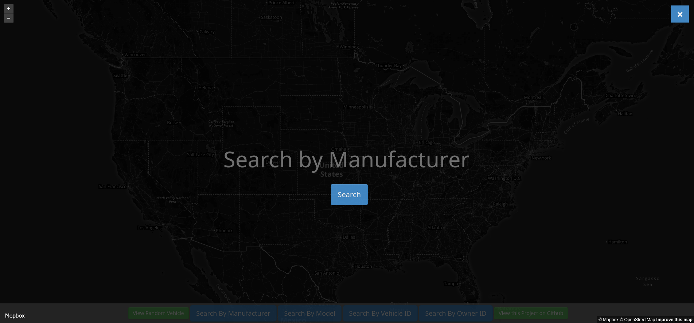

# turo_analytics
Analyzing Turo rental car data to find vehicle arbitrage opportunities in San Francisco


<h1 align=center><a href="http://turo-analytics.herokuapp.com/">Check out the Turo Analytics Web App</a></h1>

## Dataset

To pull information on every vehicle listing while using the least amount of networks requests, I created a (pretty greedy) algorithm in *genLatLong.py* that attempts to find the largest covered area while using the least amount of coordinates.

<p align="center">
  
  <br>
  <i>
    <b>
      Data Visualization representing the Long/Lat points used to create the Dataset
    </b>
  </i>
</p>

<h3 align=center>Note: This dataset contains information on roughly ~40,000 currently listed (As of 07/08/2018) vehicles on Turo.  The dataset contains <a href="https://github.com/theriley106/turo_analytics/blob/master/searchParams.md" target="_blank">**84** Data Points</a> for each vehicle.</h3>

<h2 align=center><a href="https://www.kaggle.com/theriley106/turo-rental-car-pricing-info">Download the Dataset Here</a></h2>

## Web Application

<p align="center">
  
  <br>
  <i>
    <b>
      Main Page
    </b>
  </i>
</p>


<p align="center">
  
  <br>
  <i>
    <b>
      Search By Manufacturer
    </b>
  </i>
</p>

<p align="center">
  
  <br>
  <i>
    <b>
      Finding all Tesla vehicles listed on Turo
    </b>
  </i>
</p>

<p align="center">
  
  <br>
  <i>
    <b>
      Move the interactive map to find location-specific listings
    </b>
  </i>
</p>

<p align="center">
  
  <br>
  <i>
    <b>
      Vehicle Information Page
    </b>
  </i>
</p>


## REST API

I used Flask to create a REST API that would make it easier to interact with the dataset.  The API returns specified vehicle information based on the filters and parameters you use in the URL.  GET and POST methods are both supported.

***

<h3 align="center">/api/?filter={}&keyword={}&values={},{}&limit={}</h3>

### Examples:

##### GET: /api/?filter=vehicle_make&keyword=Tesla&values=vehicle_model,rate_daily&limit=5

```javascript
Response:
{
  "data": [
    {
      "rate_daily": 252.0,
      "vehicle_model": "Model S"
    },
    {
      "rate_daily": 140.0,
      "vehicle_model": "Model 3"
    },
    {
      "rate_daily": 116.0,
      "vehicle_model": "Model S"
    },
    {
      "rate_daily": 430.0,
      "vehicle_model": "Model X"
    },
    {
      "rate_daily": 574.0,
      "vehicle_model": "Model X"
    }
  ],
  "success": true
}
```

##### GET: /api/?filter=vehicle_model&keyword=karma&values=vehicle_make,vehicle_model,rate_daily,location_city&limit=3

```javascript
Response:
{
  "data": [
    {
      "location_city": "Stamford",
      "rate_daily": 902.0,
      "vehicle_make": "Fisker",
      "vehicle_model": "Karma"
    },
    {
      "location_city": "Fontana",
      "rate_daily": 717.0,
      "vehicle_make": "Fisker",
      "vehicle_model": "Karma"
    },
    {
      "location_city": "Atlanta",
      "rate_daily": 299.0,
      "vehicle_make": "Fisker",
      "vehicle_model": "Karma"
    }
  ],
  "success": true
}
```

##### GET: /api/?filter=vehicle_make&keyword=Tesla&values=vehicle_name&limit=10

```javascript
Response:
{
  "data": [
    {
      "vehicle_name": "Jim's Tesla"
    },
    {
      "vehicle_name": "Ken's Tesla Model 3"
    },
    {
      "vehicle_name": "Nathan's Tesla"
    },
    {
      "vehicle_name": "Lei's Tesla"
    },
    {
      "vehicle_name": "Megan's Tesla"
    },
    {
      "vehicle_name": "GSD Rides Maui Tesla Rental Model S P85+"
    },
    {
      "vehicle_name": "Daniel's Tesla Model 3"
    },
    {
      "vehicle_name": "Daniel's Tesla Model S"
    },
    {
      "vehicle_name": "Gavin's Tesla"
    },
    {
      "vehicle_name": "Travis's Tesla"
    }
  ],
  "success": true
}
```

<h1 align="center">Interesting Findings from the Data Set (Last updated 7/08/18</h1>

- Matias's Lamborghini Huracan is the most expensive car on Turo with a daily rate of $1140.00

- Dinton's Toyota Camry is the least expensive car on Turo with a daily rate of $10.00

- There are 649 Tesla Vehicles on Turo

- The most common vehicle model on Turo is a BMW 3 Series (569 Listings)

- Scott's 2010 Kia Soul is the most reviewed vehicle on Turo with 233 reviews

**PS. If Turo is looking for Software Engineering/Data Science Interns for the Spring/Summer of 2019, please let me know.  I would love to join the team in San Francisco :)

My Email: ChristopherLambert106@gmail.com**

