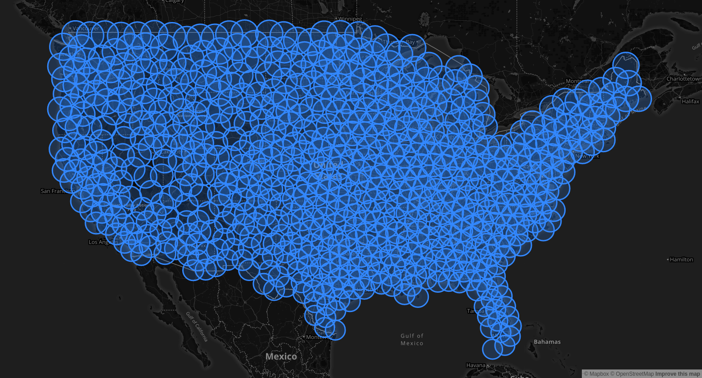

# turo_analytics
Analyzing Turo rental car data to find vehicle arbitrage opportunities in the Turo car rental marketplace
<center><h1><a href="https://www.kaggle.com/theriley106/turo-rental-car-pricing-info">Download the Dataset Here</a></h1></center>

## Getting Dataset

<p align="center">
  
</p>
<i><h3 align="center">Long Lat Points with Radius encompassing entire continental United States</h3></i>

## Dataset

This dataset contains information on roughly ~20,000 currently listed (As of 07/08/2018) vehicles on Turo.  The dataset contains the following information for each vehicle.

## Example Response

```javascript
{
    "distance": 17.0,
    "reviewCount": 0,
    "businessClass": false,
    "renterTripsTaken": 0,
    "rating": null,
    "distanceLabel": "17 mi",
    "newListing": false,
    "distanceWithUnit":
    {
        "scalar": 17,
        "unlimited": false,
        "unit": "MI"
    },
    "owner":
    {
        "lastName": "B.",
        "image":
        {
            "verified": false,
            "thumbnails":
            {
                "32x32": "https://d1zgdcrdir5wgt.cloudfront.net/media/driver/iXYfdNi1ReyINVNz8F4o_A.32x32.jpg",
                "225x225": "https://d1zgdcrdir5wgt.cloudfront.net/media/driver/iXYfdNi1ReyINVNz8F4o_A.300x300.jpg",
                "84x84": "https://d1zgdcrdir5wgt.cloudfront.net/media/driver/iXYfdNi1ReyINVNz8F4o_A.84x84.jpg",
                "300x300": "https://d1zgdcrdir5wgt.cloudfront.net/media/driver/iXYfdNi1ReyINVNz8F4o_A.300x300.jpg"
            },
            "resizableUrlTemplate": "https://d1zgdcrdir5wgt.cloudfront.net/media/driver/iXYfdNi1ReyINVNz8F4o_A.{width}x{height}.jpg",
            "placeholder": false,
            "id": null,
            "originalImageUrl": "https://d1zgdcrdir5wgt.cloudfront.net/media/driver/iXYfdNi1ReyINVNz8F4o_A.jpg"
        },
        "id": 4783843,
        "firstName": "Marcus",
        "name": "Marcus B."
    },
    "rate":
    {
        "monthly": 0.3,
        "averageDailyPrice": 902.0,
        "weekly": 0.15,
        "daily": 902.0,
        "averageDailyPriceWithCurrency":
        {
            "amount": 902.0,
            "currencyCode": "USD"
        }
    },
    "rentableFromSearchedAirport": false,
    "freeDeliveryPromotion": false,
    "location":
    {
        "city": "Rochester Hills",
        "country": "US",
        "precision":
        {
            "level": "APPROXIMATE",
            "accuracy": 0.09320565
        },
        "longitude": -83.12675,
        "locationSource": "GOOGLE",
        "state": "MI",
        "addressLines": ["Rochester Hills, MI"],
        "address": "Rochester Hills, MI 48307",
        "latitude": 42.639309,
        "timeZone": "America/New_York"
    },
    "responseTime": null,
    "vehicle":
    {
        "trim": null,
        "automaticTransmission": true,
        "name": "Marcus's Maserati",
        "url": "/rentals/cars/mi/rochester-hills/maserati-quattroporte/355498",
        "image":
        {
            "verified": false,
            "thumbnails":
            {
                "620x372": "https://d1zgdcrdir5wgt.cloudfront.net/media/vehicle/images/nZw5PNEHRV20pm2JLYAHoA.620x372.jpg",
                "50x30": "https://d1zgdcrdir5wgt.cloudfront.net/media/vehicle/images/nZw5PNEHRV20pm2JLYAHoA.50x30.jpg",
                "170x125": "https://d1zgdcrdir5wgt.cloudfront.net/media/vehicle/images/nZw5PNEHRV20pm2JLYAHoA.170x102.jpg",
                "574x343": "https://d1zgdcrdir5wgt.cloudfront.net/media/vehicle/images/nZw5PNEHRV20pm2JLYAHoA.620x372.jpg",
                "170x102": "https://d1zgdcrdir5wgt.cloudfront.net/media/vehicle/images/nZw5PNEHRV20pm2JLYAHoA.170x102.jpg",
                "100x60": "https://d1zgdcrdir5wgt.cloudfront.net/media/vehicle/images/nZw5PNEHRV20pm2JLYAHoA.100x60.jpg"
            },
            "resizableUrlTemplate": "https://d1zgdcrdir5wgt.cloudfront.net/media/vehicle/images/nZw5PNEHRV20pm2JLYAHoA.{width}x{height}.jpg",
            "placeholder": false,
            "id": null,
            "originalImageUrl": "https://d1zgdcrdir5wgt.cloudfront.net/media/vehicle/images/nZw5PNEHRV20pm2JLYAHoA.jpg"
        },
        "marketCountry": "US",
        "year": 2012,
        "id": 355498,
        "listingCreatedTime": 1513255482000,
        "registration": null,
        "model": "Quattroporte",
        "type": "car",
        "make": "Maserati",
        "marketCurrency":
        {
            "decimalPlaces": 2,
            "defaultFractionDigits": 2,
            "symbol": "USD",
            "currencyCode": "USD"
        }
    },
    "images": [
    {
        "verified": false,
        "thumbnails":
        {
            "620x372": "https://d1zgdcrdir5wgt.cloudfront.net/media/vehicle/images/nZw5PNEHRV20pm2JLYAHoA.620x372.jpg",
            "50x30": "https://d1zgdcrdir5wgt.cloudfront.net/media/vehicle/images/nZw5PNEHRV20pm2JLYAHoA.50x30.jpg",
            "170x125": "https://d1zgdcrdir5wgt.cloudfront.net/media/vehicle/images/nZw5PNEHRV20pm2JLYAHoA.170x102.jpg",
            "574x343": "https://d1zgdcrdir5wgt.cloudfront.net/media/vehicle/images/nZw5PNEHRV20pm2JLYAHoA.620x372.jpg",
            "170x102": "https://d1zgdcrdir5wgt.cloudfront.net/media/vehicle/images/nZw5PNEHRV20pm2JLYAHoA.170x102.jpg",
            "100x60": "https://d1zgdcrdir5wgt.cloudfront.net/media/vehicle/images/nZw5PNEHRV20pm2JLYAHoA.100x60.jpg"
        },
        "resizableUrlTemplate": "https://d1zgdcrdir5wgt.cloudfront.net/media/vehicle/images/nZw5PNEHRV20pm2JLYAHoA.{width}x{height}.jpg",
        "placeholder": false,
        "id": null,
        "originalImageUrl": "https://d1zgdcrdir5wgt.cloudfront.net/media/vehicle/images/nZw5PNEHRV20pm2JLYAHoA.jpg"
    },
    {
        "verified": false,
        "thumbnails":
        {
            "620x372": "https://d1zgdcrdir5wgt.cloudfront.net/media/vehicle/images/fxG0_Sd0TL6p55sBd4mxYQ.620x372.jpg",
            "50x30": "https://d1zgdcrdir5wgt.cloudfront.net/media/vehicle/images/fxG0_Sd0TL6p55sBd4mxYQ.50x30.jpg",
            "170x125": "https://d1zgdcrdir5wgt.cloudfront.net/media/vehicle/images/fxG0_Sd0TL6p55sBd4mxYQ.170x102.jpg",
            "574x343": "https://d1zgdcrdir5wgt.cloudfront.net/media/vehicle/images/fxG0_Sd0TL6p55sBd4mxYQ.620x372.jpg",
            "170x102": "https://d1zgdcrdir5wgt.cloudfront.net/media/vehicle/images/fxG0_Sd0TL6p55sBd4mxYQ.170x102.jpg",
            "100x60": "https://d1zgdcrdir5wgt.cloudfront.net/media/vehicle/images/fxG0_Sd0TL6p55sBd4mxYQ.100x60.jpg"
        },
        "resizableUrlTemplate": "https://d1zgdcrdir5wgt.cloudfront.net/media/vehicle/images/fxG0_Sd0TL6p55sBd4mxYQ.{width}x{height}.jpg",
        "placeholder": false,
        "id": null,
        "originalImageUrl": "https://d1zgdcrdir5wgt.cloudfront.net/media/vehicle/images/fxG0_Sd0TL6p55sBd4mxYQ.jpg"
    },
    {
        "verified": false,
        "thumbnails":
        {
            "620x372": "https://d1zgdcrdir5wgt.cloudfront.net/media/vehicle/images/3gPCguRtTpGrLxtiEMWzUA.620x372.jpg",
            "50x30": "https://d1zgdcrdir5wgt.cloudfront.net/media/vehicle/images/3gPCguRtTpGrLxtiEMWzUA.50x30.jpg",
            "170x125": "https://d1zgdcrdir5wgt.cloudfront.net/media/vehicle/images/3gPCguRtTpGrLxtiEMWzUA.170x102.jpg",
            "574x343": "https://d1zgdcrdir5wgt.cloudfront.net/media/vehicle/images/3gPCguRtTpGrLxtiEMWzUA.620x372.jpg",
            "170x102": "https://d1zgdcrdir5wgt.cloudfront.net/media/vehicle/images/3gPCguRtTpGrLxtiEMWzUA.170x102.jpg",
            "100x60": "https://d1zgdcrdir5wgt.cloudfront.net/media/vehicle/images/3gPCguRtTpGrLxtiEMWzUA.100x60.jpg"
        },
        "resizableUrlTemplate": "https://d1zgdcrdir5wgt.cloudfront.net/media/vehicle/images/3gPCguRtTpGrLxtiEMWzUA.{width}x{height}.jpg",
        "placeholder": false,
        "id": null,
        "originalImageUrl": "https://d1zgdcrdir5wgt.cloudfront.net/media/vehicle/images/3gPCguRtTpGrLxtiEMWzUA.jpg"
    }],
    "instantBookDisplayed": true,
    "responseRate": null,
    "deliveryLabel": null
}
```


# Model S *Used* Market Prices
| Model   | Market Price   |
| -------------------- |----------:|
|2016.5 AWD 70D | $64,688.71|
|RWD 85 kWh Battery | $59,365.30|
|2016.5 4dr Sedan AWD 60D | $71,496.00|
|90D AWD | $85,877.00|
|AWD 90D Dual Motor | $78,599.00|
|75 RWD | $68,713.08|
|P85D - NAV - SNRF - RRVW | $78,995.00|
|Performance | $54,251.15|
|75D AWD | $78,689.00|
|4dr Sedan Performance | $51,747.00|
|AWD P85D Performance | $71,238.36|
|RWD 70 kWh Battery | $59,738.50|
|2016.5 AWD 90D | $75,068.14|
|P100D AWD | $109,993.00|
|2016.5 4dr Sedan RWD 60 | $61,329.00|
|Sedan | $46,943.38|
|P85D 1 Owner Clean Carfax Autopilot | $76,888.00|
|2016.5 AWD P90D | $94,989.67|
|P85D | $65,309.50|
|4dr Sedan P85D | $65,995.00|
|2016.5 RWD 75 kWh Battery | $66,626.33|
|2016.5 4dr Sedan AWD P100D | $115,561.33|
|100D AWD | $81,497.50|
|2016.5 AWD 75D | $70,492.40|
|4dr Sedan | $46,988.00|
|AWD 70D Dual Motor | $61,823.19|
|4dr Sedan Signature Performance | $48,500.00|
|RWD 60 kWh Battery | $50,832.86|
|4dr Sedan 85 kWh Battery | $52,683.95|
|4dr Sedan Signature | $49,151.60|
|AWD 85D Dual Motor | $64,942.06|


```python
# This is a helper function to convert the floats into dollar amounts
# This was used for creating the README...
def convertMoney(string_val):
	f = re.findall("(\d+.\d+)\|", str(string_val))
	for val in f:
		string_val = string_val.replace(val, '${:,.2f}'.format(float(val)))
	return string_val
```


## In Conclusion

**PS. If Turo is looking for Software Engineering/Data Science Interns for the Spring/Summer of 2019, please let me know.  I really love your company's business model, and I would love to join the team in San Francisco :)**

My Email: ChristopherLambert106@gmail.com
