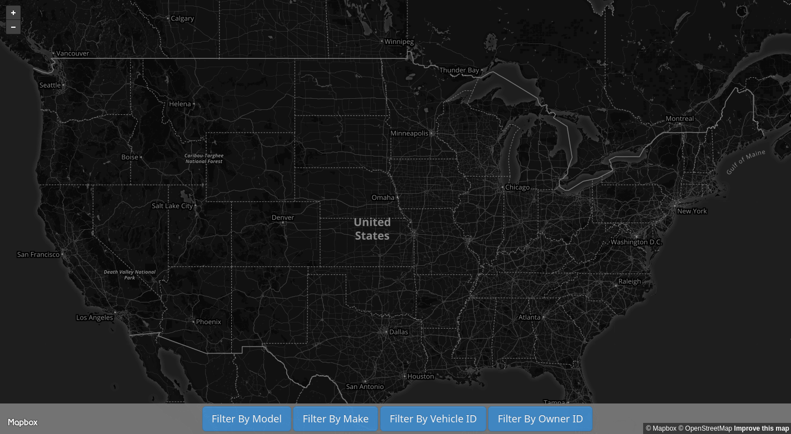
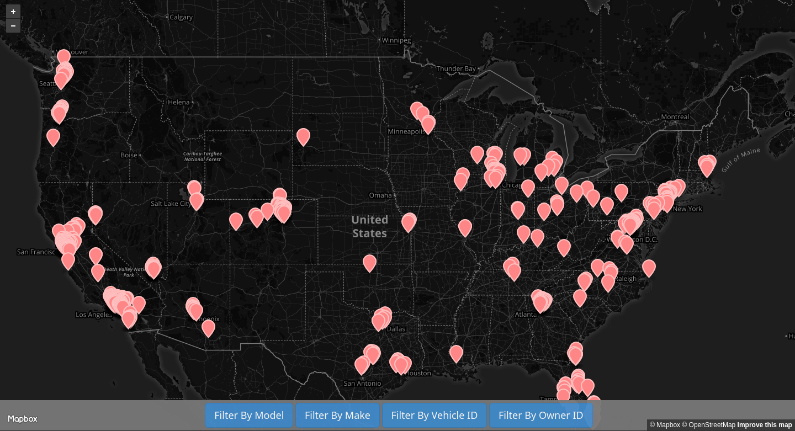
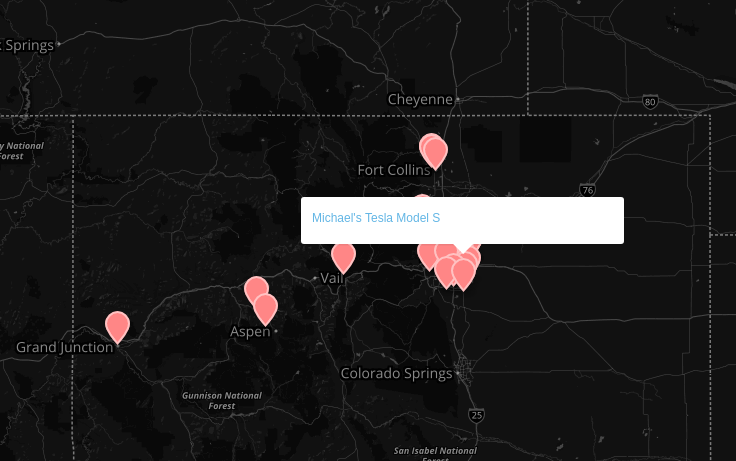

# turo_analytics
Analyzing Turo rental car data to find vehicle arbitrage opportunities in San Francisco
<center><h1><a href="https://www.kaggle.com/theriley106/turo-rental-car-pricing-info">Download the Dataset Here</a></h1></center>

<center><h1><a href="http://turo-analytics.herokuapp.com/">Check out the Turo Analytics Web App</a></h1></center>


## Web Application

<p align="center">
  
</p>
<i><h3 align="center">Main Page</h3></i>


<p align="center">
  
</p>
<i><h3 align="center">Search By Make: Tesla</h3></i>

<p align="center">
  
</p>
<i><h3 align="center">Search Results</h3></i>


## REST API

I wrote the API to make it easier to interact with the dataset.  It's a simple Flask-Based REST API that will return specified vehicle information based on the filters and parameters you use in the URL.  GET and POST methods are both supported.

<h3 align="center">/api/?filter={}&keyword={}&values={},{}&limit={}</h3>

### Examples:

##### GET: /api/?filter=vehicle_make&keyword=Tesla&values=vehicle_model,rate_daily&limit=5

```javascript
Response:
{
  "data": [
    {
      "rate_daily": 252.0,
      "vehicle_model": "Model S"
    },
    {
      "rate_daily": 140.0,
      "vehicle_model": "Model 3"
    },
    {
      "rate_daily": 116.0,
      "vehicle_model": "Model S"
    },
    {
      "rate_daily": 430.0,
      "vehicle_model": "Model X"
    },
    {
      "rate_daily": 574.0,
      "vehicle_model": "Model X"
    }
  ],
  "success": true
}
```

##### GET: /api/?filter=vehicle_model&keyword=karma&values=vehicle_make,vehicle_model,rate_daily,location_city&limit=3

```javascript
Response:
{
  "data": [
    {
      "location_city": "Stamford",
      "rate_daily": 902.0,
      "vehicle_make": "Fisker",
      "vehicle_model": "Karma"
    },
    {
      "location_city": "Fontana",
      "rate_daily": 717.0,
      "vehicle_make": "Fisker",
      "vehicle_model": "Karma"
    },
    {
      "location_city": "Atlanta",
      "rate_daily": 299.0,
      "vehicle_make": "Fisker",
      "vehicle_model": "Karma"
    }
  ],
  "success": true
}```

##### GET: /api/?filter=vehicle_make&keyword=Tesla&values=vehicle_name&limit=10
```javascript
Response:
{
  "data": [
    {
      "vehicle_name": "Jim's Tesla"
    },
    {
      "vehicle_name": "Ken's Tesla Model 3"
    },
    {
      "vehicle_name": "Nathan's Tesla"
    },
    {
      "vehicle_name": "Lei's Tesla"
    },
    {
      "vehicle_name": "Megan's Tesla"
    },
    {
      "vehicle_name": "GSD Rides Maui Tesla Rental Model S P85+"
    },
    {
      "vehicle_name": "Daniel's Tesla Model 3"
    },
    {
      "vehicle_name": "Daniel's Tesla Model S"
    },
    {
      "vehicle_name": "Gavin's Tesla"
    },
    {
      "vehicle_name": "Travis's Tesla"
    }
  ],
  "success": true
}
```

## Dataset

### Getting Dataset

To create the dataset I needed to pull information on every vehicle listing while using the least amount of networks requests as possible.  To do this, I created a (pretty greedy) algorithm in *genLatLong.py* that attempts to find the largest covered area while using the least amount of coordinates.

<p align="center">
  
</p>

<i><h3 align="center">Data Visualization representing the Long/Lat points used to create the Dataset</h3></i>

This dataset contains information on roughly ~40,000 currently listed (As of 07/08/2018) vehicles on Turo.  The dataset contains <a href="https://github.com/theriley106/turo_analytics/blob/master/searchParams.md" target="_blank">**84** Data Points for each vehicle.</a>

## Misc Visualizations


## Interesting Findings (Info is current to 07/08/2018)

### Matias's Lamborghini Huracan is the most expensive car on Turo with a daily rate of $1140.00

**PS. If Turo is looking for Software Engineering/Data Science Interns for the Spring/Summer of 2019, please let me know.  I would love to join the team in San Francisco :)

My Email: ChristopherLambert106@gmail.com**

